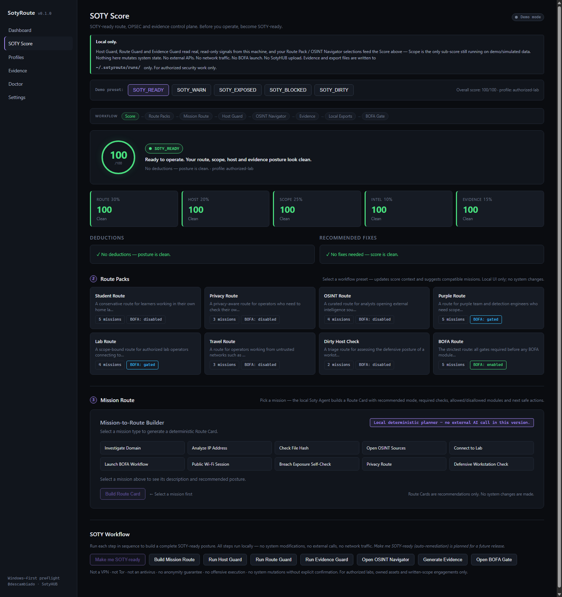

# SotyRoute

[](https://github.com/descambiado/SotyRoute/actions/workflows/ci.yml)
[](LICENSE)
[](README.md#8-quickstart)
[](https://tauri.app)
[](https://www.rust-lang.org)

**SotyRoute — SOTY-ready route, OPSEC and evidence control plane.**

> *Before you operate, become SOTY-ready.*

SotyRoute Desktop is a **local, demo-ready** control plane for security engineers, detection engineers and pentesters working in **authorized** environments. It gives you an explainable readiness score (SOTY Score), a mission-to-route builder (Soty Agent), guided workflow presets (Route Packs), a safe host posture check (Host Guard), an authorized OSINT resource catalog, local evidence snapshots, and a BOFA Gate decision engine — all running **entirely on your machine** with no external calls.

Maintained by [@descambiado](https://github.com/descambiado) as part of the **SotyHUB** ecosystem (alongside **BOFA**).

> **Status — PR 1–15 shipped.**
> The full SOTY direction (PRs 2–15) is implemented.
> SOTY Score engine · Route Packs · Mission-to-Route Builder ·
> **Host Guard (real, read-only signals from your machine)** ·
> Ethical OSINT Navigator (35-resource catalog) · Evidence Snapshots · BOFA Gate ·
> SotyHUB Local Exports · Visual/demo polish · Security dependency maintenance.
>
> The SOTY Score itself (route/scope/intel/evidence sub-scores) still runs against demo
> presets — only Host Guard reads the real local machine so far.
>
> **Upcoming:** optional SotyHUB sync integration · real signal collection for the
> remaining SOTY Score sub-scores.
>
> See [docs/roadmap.md](docs/roadmap.md).

---

## 0. What SOTY means

**SOTY** can mean Student of the Year, Son of the Year, Shooter of the Year — or **Security
Operator of the Year**. In SotyRoute, **SOTY** means someone who operates with **route,
discipline, OPSEC, scope, evidence and technical precision**.

Becoming *SOTY-ready* is the whole point: get your posture in order **before** you operate, not
after something leaks.

## 1. What is SotyRoute?

SotyRoute is not a VPN. It is not Tor. It does not promise anonymity.

It is an **AI-assisted OPSEC route builder** built on a **preflight + evidence layer** for network
operations:

- Computes your **SOTY Score** — an explainable readiness rating across route, host, scope, intel and evidence.
- Matches you to a **Route Pack** — a pre-set workflow bundle for your class of work.
- Builds a **Route Card** from your mission — mode, required checks, allowed/disallowed modules, next safe actions.
- Runs a **Host Guard** posture check — read-only signals, no system mutations.
- Surfaces an **Ethical OSINT Navigator** — a local authorized resource catalog with confirmation gates.
- Assembles a **local Evidence Snapshot** — redacted, structured, no external write.
- Evaluates a **BOFA Gate** decision and writes **local export files** (`bofa_export.json`, `sotyhub_export.json`).

## 2. Why not just use a VPN?

| A VPN gives you | SotyRoute gives you |
|---|---|
| An encrypted tunnel | A documented routing posture |
| Maybe a kill-switch | Scope-bound profiles per lab |
| Maybe a leak test page | DNS / routing / firewall checks captured as evidence |
| No idea what your tooling will do | A dry-run plan you read **before** execution |
| No audit trail | `session.json` + `evidence.md` per run |

A VPN does not know whether you are inside an authorized lab. SotyRoute does.

## 3. Why better than Nipe?

[Nipe](https://github.com/htrgouvea/nipe) is a Perl script that routes Linux traffic through Tor. SotyRoute is broader and safer:

| Feature | Nipe | SotyRoute Desktop |
|---|---|---|
| Windows GUI | no | **yes** |
| Multi-transport (Tor / WG / SOCKS5 / Observe / Lab) | no | **yes** |
| YAML profiles | no | **yes** |
| Dry-run planner | no | **yes** |
| Evidence reports | no | **yes** |
| Lab scope validation | no | **yes** |
| BOFA / SotyHUB exports | no | **yes** |
| Honest copy about anonymity | partial | **yes** |
| Reversible / fail-closed design | no | **goal** |

## 4. Core features (v0.1.0 foundation)

- **Dashboard** with current mode, profile, routing/DNS/tunnel/kill-switch status.
- **Profiles** page: load, validate, import/export YAML/JSON.
- **Evidence** page: browse sessions, open `evidence.md`, export BOFA / SotyHUB JSON.
- **Doctor** page: Windows version, admin status, interfaces, DNS, Tor / WireGuard detection.
- **Settings**: evidence directory, default mode, telemetry off, theme.
- **Observe mode**: non-destructive system snapshot.
- **Dry-run** for Tor / WireGuard / SOCKS5 / Lab.
- **Local evidence directory**: `%USERPROFILE%\.sotyroute\runs\<timestamp>_<mode>\`.

## 5. Windows-first architecture

```
Desktop UI (Tauri + React, no admin)
        │  Tauri IPC
        ▼
Local Agent  (v0.1.0 stub; v0.2.0 Windows Service, elevated)
        │
        ▼
Core Engine  (profiles · checks · planner · evidence · exports)
```

See [docs/windows-architecture.md](docs/windows-architecture.md) and [docs/architecture.md](docs/architecture.md).

## 6. Safety model

- **UI never runs as admin.** Privileged actions are reserved for the agent (future).
- **Dry-run by default** for any action that would mutate the system.
- **Fail-closed** design goal: if a check fails, the operation does not proceed.
- **Evidence first**: every session writes `session.json`, `checks.json`, `plan.json`, `evidence.md`.
- **No third-party network changes** in v0.1.0.

See [docs/threat-model.md](docs/threat-model.md).

## 7. What SotyRoute does **not** do

These boundaries are permanent and apply to the full SOTY direction:

- It is **not** a VPN provider. No servers are shipped.
- It is **not** Tor.
- It does **not** guarantee anonymity.
- It is **not** an antivirus or EDR.
- It does **not** launch BOFA or execute BOFA modules.
- It does **not** upload to SotyHUB or call external APIs.
- It does **not** scrape external sites or embed WebViews.
- It does **not** automate credential-dump searches, doxxing, or leak-site access.
- It does **not** evade law enforcement or ship offensive payloads.
- It does **not** mutate system settings or network configuration in the current release.
- WireGuard requires an existing server/configuration you own or are authorized to use.
- Tor is not a VPN; SOCKS5 is not honored by every application.
- Local export files (`bofa_export.json`, `sotyhub_export.json`) are written to `~/.sotyroute/runs/` **only** — no upload, no sync, no external destination.

SotyRoute is for **authorized labs, owned assets, defensive research and written-scope
engagements** only. See [docs/legal-scope.md](docs/legal-scope.md).

## 8. Quickstart

**Prerequisites**

- Windows 10/11 (x64)
- [Node.js](https://nodejs.org/) 20.19+ or 22.12+ (required by Vite 8 / Rolldown)
- [Rust](https://www.rust-lang.org/tools/install) stable (`rustup`)
- Microsoft C++ Build Tools (installed by Rust on Windows)
- WebView2 runtime (preinstalled on Win11)

**Install & run dev**

```powershell
cd apps/desktop
npm install
npm run tauri dev
```

The first run will compile the Rust backend (a few minutes). Subsequent runs are fast.

**Build a release MSI**

```powershell
cd apps/desktop
npm run tauri build
```

Artifacts: `apps/desktop/src-tauri/target/release/bundle/msi/`.

> If Tauri complains about missing icons, generate them with `npx @tauri-apps/cli icon path/to/logo.png` and re-run.

## 9. Demo walkthrough

Navigate to **`/soty`** in the running app and follow these steps:

| Step | Action | What you see |
|---|---|---|
| 1 | Pick a **demo preset** (Soty-Ready / Warn / Exposed / Dirty / Blocked) | SOTY Score ring + state badge updates |
| 2 | Select a **Route Pack** | Score context syncs; compatible missions appear |
| 3 | Pick a **mission** and click **Build Mission Route** | Route Card: mode, checks, allowed/disallowed modules, next actions |
| 4 | Click **Run Host Guard** | 7-check posture panel — reads real firewall, Defender, proxy and process signals from this machine (read-only) |
| 5 | Click **Open OSINT Navigator** | 35-resource authorized catalog; category/risk filters; confirmation gates |
| 6 | Click **Generate Evidence** | Local `SotyEvidenceSnapshot` — JSON/Markdown copy-to-clipboard |
| 7 | Click **Open BOFA Gate** | Local gate decision (allowed / warning / blocked); module lists |
| 8 | Click **Prepare BOFA export** + **Prepare SotyHUB export** + **Save exports locally** | `bofa_export.json` + `sotyhub_export.json` written to `~/.sotyroute/runs/` |

All steps run locally. No network traffic. No BOFA launch. No SotyHUB upload.

## 10. Screenshots

_Screenshots to be added after first build. Place captures in `docs/assets/`._

| Screenshot | Path |
|---|---|
| SOTY Dashboard — score ring, sub-scores, deduction list | `docs/assets/soty-dashboard.png` |
| Evidence Snapshot — local JSON/Markdown preview | `docs/assets/soty-evidence.png` |
| BOFA Gate + Local Exports — gate decision and export panel | `docs/assets/soty-exports.png` |

See [docs/assets/README.md](docs/assets/README.md) for capture instructions.

```markdown



```

## 11. Evidence files

Every run writes to `%USERPROFILE%\.sotyroute\runs\<timestamp>_<mode>\`:

- `session.json` — high-level session metadata
- `checks.json` — system checks captured
- `plan.json` — dry-run plan (read this before any real execution)
- `warnings.json` — collected warnings
- `evidence.md` — human-readable report
- `soty_evidence.json` — SOTY Evidence Snapshot (JSON, PR 10)
- `soty_evidence.md` — SOTY Evidence Snapshot (Markdown, PR 10)
- `bofa_export.json` — BOFA Gate decision record (PR 11)
- `sotyhub_export.json` — SotyHUB counts-only summary (PR 11)

## 12. BOFA integration

SotyRoute emits a `bofa_export.json` per session intended as a **preflight signal**: BOFA workflows can refuse to launch offensive modules until SotyRoute reports `preflight_passed: true` for a matching profile. The BOFA Gate decision engine is local and deterministic — it does not launch BOFA and does not call external services.

See [docs/bofa-gate.md](docs/bofa-gate.md) and [docs/bofa-integration.md](docs/bofa-integration.md).

## 13. SotyHUB integration

SotyRoute writes a local `sotyhub_export.json` with counts-only summaries (no raw host data, no OSINT query content, no credentials). No upload is performed. No SotyHUB API is called. The file is a structured local record ready for future optional SotyHUB sync.

See [docs/sotyhub-export.md](docs/sotyhub-export.md) and [docs/sotyhub-integration.md](docs/sotyhub-integration.md).

## 14. Roadmap

See [docs/roadmap.md](docs/roadmap.md). Summary:

- **v0.1.0** — Desktop UI, observe + dry-run, evidence, exports.
- **v0.2.0** — Schema versioning, public-IP check, TCP probe; Windows Service agent groundwork. *(current)*
- **v0.3.0 — SOTY direction** — SOTY Score · Soty Agent (Route Card) · Route Packs · Host Guard (demo mode) · Ethical OSINT Navigator · Evidence Snapshots · BOFA Gate + SotyHUB local exports · Visual/demo polish. **Shipped PRs 2–12.**
- **Upcoming** — Read-only real Host Guard Tauri signals; security dependency updates; optional SotyHUB sync.
- **v0.4.0** — WFP policy engine research, signed evidence bundles, BOFA preflight live.
- **v1.0.0** — Stable agent, audited rollback, signed releases.

## 15. Legal & ethical scope

SotyRoute is for **authorized** security work only: your own assets, your own lab, or systems for which you hold written authorization. See [docs/legal-scope.md](docs/legal-scope.md).

## 16. SOTY Score

An **explainable readiness score**. Five sub-scores — **Route, Host, Scope, Intel, Evidence** —
roll up into an **Overall SOTY Score** and a single state: `SOTY_READY`, `SOTY_WARN`,
`SOTY_EXPOSED`, `SOTY_DIRTY` or `SOTY_BLOCKED`. Every deduction carries a **reason** and a
**recommended fix** — the score is never a mystery number.

See [docs/soty-score.md](docs/soty-score.md).

## 17. Soty Agent (Mission-to-Route Builder)

A **deterministic local route builder**. Pick or type a mission — *investigate a domain*, *work from public WiFi*, *prepare a privacy route*, *launch BOFA* — and the agent produces a **Route Card**: recommended mode, required checks, tools/resources, risk warnings, scope requirements, evidence settings, allowed/disallowed BOFA modules and next safe actions. **Recommends only** — no external AI call, no system mutations, explicit confirmation required.

See [docs/soty-agent.md](docs/soty-agent.md).

## 18. Route Packs

Predefined bundles that pre-set mode, checks, evidence level and BOFA mode for a class of work:
**Student, Privacy, OSINT, Purple, Lab, Travel, Dirty Host Check** and **BOFA** routes. Packs
compose the existing YAML profile schema — they narrow posture, they never widen scope.

See [docs/route-packs.md](docs/route-packs.md).

## License

MIT — see [LICENSE](LICENSE).
